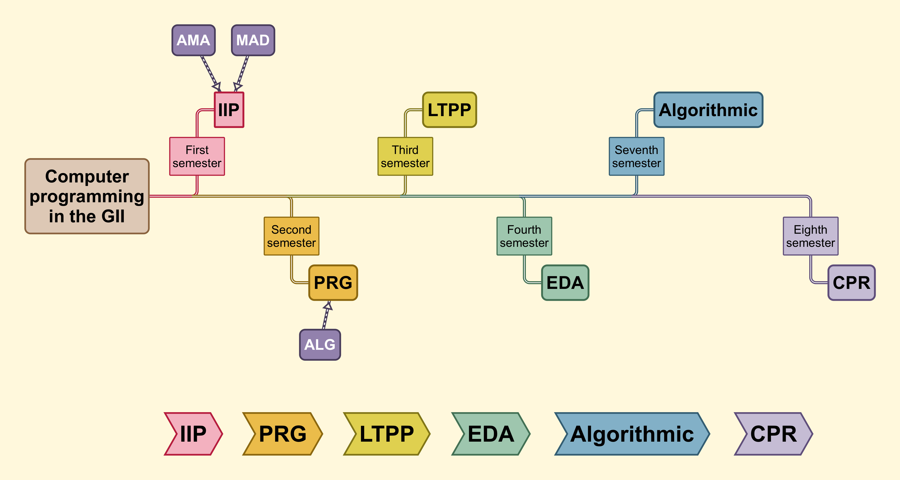
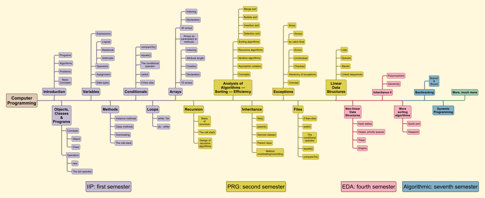

# Programming

### Purpose
This repository contains code written by Jon Ander Gómez as examples for students
during his classes of Computer Programming at the [**Technical University of Valencia (UPV)**](https://www.upv.es/).
All corresponds to the first academic year of the Bachelor's Degree in Computer Engineering of the
[**School of Informatics (ETSINF)**](https://www.etsinf.upv.es/) of the UPV.

The Bachelor's Degre in Computer Engineering is know in Spanish as ***Grado en Ingeniería Informática (GII)***.

The School of Informatics is know in Spanish as ***Escuela Técnica Superior de Ingeniería Informática (ETSINF)***.

### The subjects related to this repository are **IIP** and **PRG**

* IIP is the acronym of the first semester subject and stands for Spanish title _**Introducción a la Informática y la Programación**_
* PRG is the acronym of the second semester subject and stands for Spanish title _**Programación**_

The next figure shows where both subjects are in the context of the Bachelor's Degree in Computer Engineering.

### Folders with code are organised by topics

In some cases you will find examples in one folder covering topics assigned to another folder, please, accept my apologies if this confuses you.

* [code](code)

### Distribution of the contents of Computer Programming
The following figure shows the distribution of *Computer Programming* as a matter tought in several subjects along the Degree in Computer Engineering.

